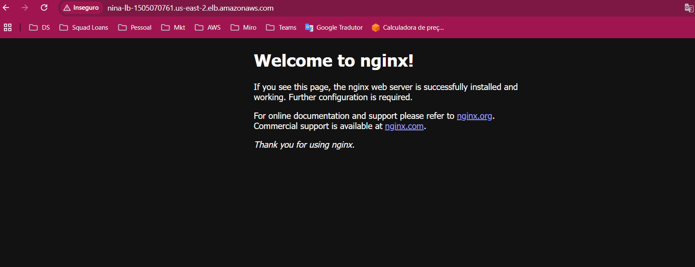

Steps:

1. security groups - load balancer inbound (port 80)
2. security groups - services (inbound traffic from load balancer)
3. Criar cluster ou importar
4. Criar task definition ou importar (recomendado a não ser que já tenha um template anterior para copiar)
5. Criar VPC e subnets ou utilizar VPC padrão
6. Criar serviço

Ao rodar o projeto temos finalmente: 

