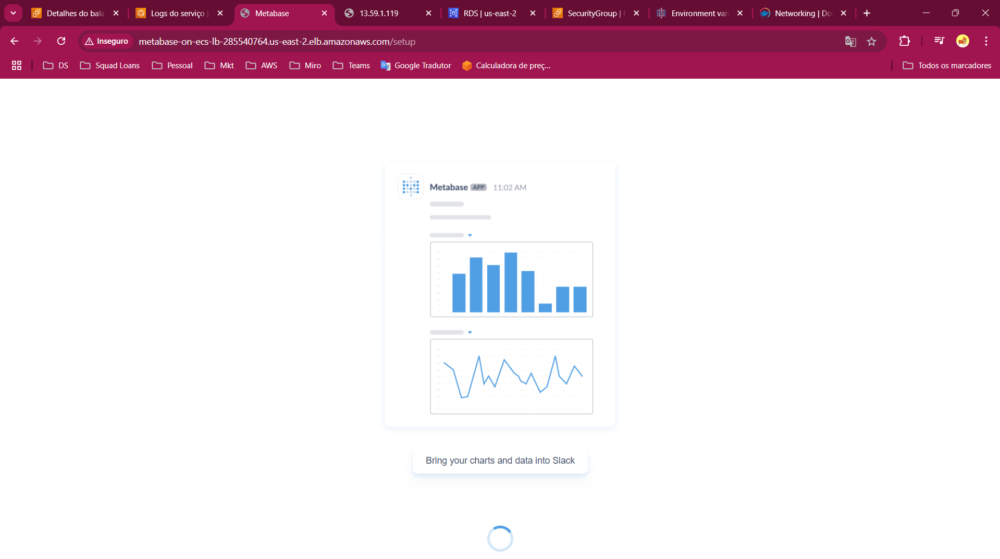

Steps:

1. security groups - load balancer inbound (port 80)
    - LB
    - Service
    - RDS
2. Criar VPC e subnets ou utilizar VPC padrão
3. Criar RDS
4. Criar cluster ou importar
5. Criar task definition ou importar (recomendado a não ser que já tenha um template anterior para copiar)
6. Criar Load Balancer
7. Criar serviço
8. Abrir o dns no /setup

Ao rodar o projeto teremos: 

Voilá! agora você pode criar seu usuário e poder distribuir questions por aí!