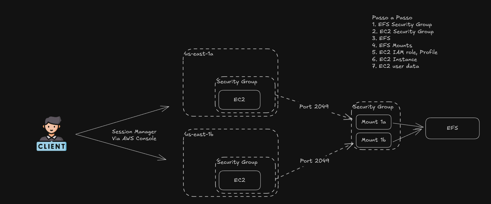

# EFS for EC2!

We want to be able to create multiple EC2 that have access to the same EFS System, for this we need:
- Create an EFS
- Allow the access of EFS for the EC2 Instance from the nfs port
- Create the first EC2 Instance with a ingress rule to allow my conection from ssh (but we gonna try the access via session manager into console)
- after that we gonna rebuild the instance direct attaching the EFS to an specific dir ex: data/
- try to access it!


Comandos a serem utilizados dentro do EC2
```shell
sudo -i
sudo yum install -y amazon-efs-utils
mkdir data
sudo mount -t efs -o tls ${efs-id}:/ data
date >> data/nina.log 
```

Architecture:



https://app.excalidraw.com/s/5fm5shfM4xL/89QnsBTG10t