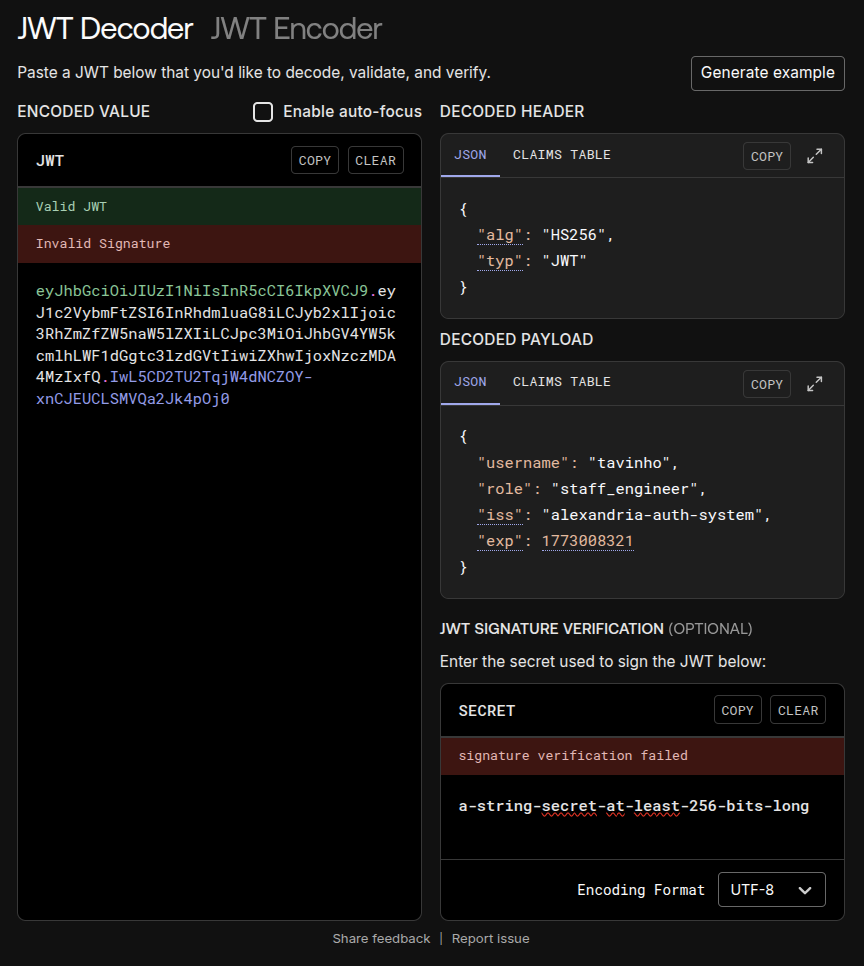
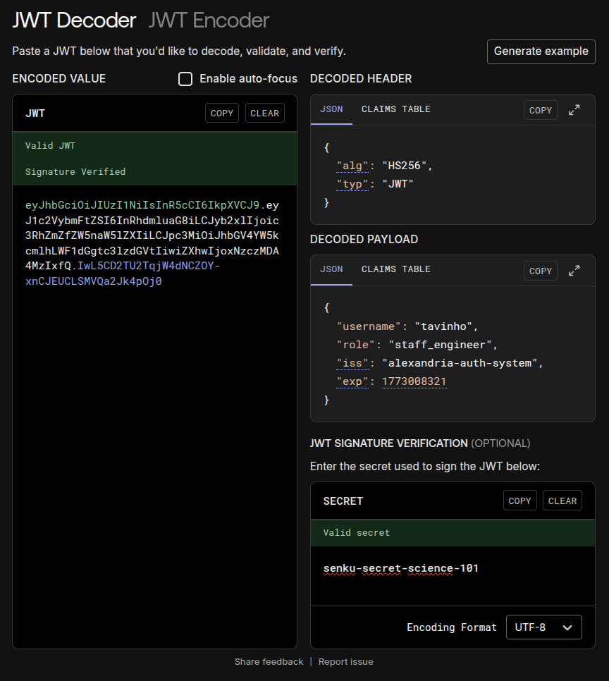

# 🏛️ Alexandria Auth Lab 01: JWT Symmetric (HS256)

> **"Não existe mágica, apenas ciência e matemática."** — Senku

Este é o primeiro laboratório do projeto **Alexandria Gatekeeper**. O objetivo aqui é desmistificar o JWT (JSON Web Token) removendo toda a abstração de frameworks (como Keycloak ou Auth0) e implementando a assinatura e validação "na unha" usando Golang.

## 🎯 O Que Você Vai Aprender

Neste laboratório, focamos na **Assinatura Simétrica (HS256)**.

1. **Estrutura do JWT:** O que realmente são aquelas três partes separadas por pontos (`.`).
2. **Integridade de Dados:** Como garantir que ninguém alterou o conteúdo do token (Payload) sem saber a senha.
3. **Claims (Reivindicações):** A diferença entre dados de protocolo (`exp`, `iss`) e dados de negócio (`role`, `username`).
4. **O "Algo Confusion Attack":** Por que validar o cabeçalho `alg` é a linha de defesa mais importante do seu código.

---

## 🧪 O Experimento

O arquivo `main.go` não é apenas um servidor; é uma **simulação de três atores** interagindo no mesmo palco:

### 1. O Emissor (The Mint) 🏦

* **Função:** Gera o token.
* **Ação:** Cria um JSON (Payload), define o algoritmo (HS256) e "carimba" (assina) usando uma **Chave Secreta** (`jwtKey`).
* **Resultado:** Uma string `eyJ...` válida.

### 2. O Guarda (The Validator) 👮

* **Função:** Protege o recurso.
* **Ação:** Recebe a string. Ele possui a **mesma Chave Secreta** do Emissor. Ele refaz o cálculo matemático da assinatura. Se o resultado bater com o que veio no token, ele deixa passar.
* **Regra de Ouro:** Ele verifica se o algoritmo é `HMAC` antes de confiar no token.

### 3. O Falsificador (The Forger) 🕵️

* **Função:** Tentar quebrar o sistema.
* **Ação:** Pega um token válido e altera uma letra da assinatura ou do payload *sem* saber a chave secreta.
* **Resultado Esperado:** O Guarda deve rejeitar instantaneamente (`signature is invalid`).

---

## 🛠️ Como Executar

### Pré-requisitos

* Go 1.20+ instalado.

### Passo a Passo

1. **Inicie o Módulo:**
```bash
go mod init alexandria-auth-lab/01-jwt-symmetric-raw
go get github.com/golang-jwt/jwt/v5

```


2. **Rode o Laboratório:**
```bash
go run main.go

```


3. **Analise a Saída:**
Você verá o console narrando a história: a criação do token, a validação bem-sucedida e a tentativa falha de adulteração.

---

## 🧠 Deep Dive: Conceitos Chave

### 1. O Que é HS256?

**HMAC with SHA-256.**
É um algoritmo de **Chave Simétrica**.

* **Simetria:** A *mesma* chave que assina é a chave que valida.
* **Cenário de Uso:** Ótimo para microsserviços internos onde todos confiam uns nos outros e podem compartilhar o segredo.
* **Risco:** Se o segredo vazar de qualquer ponta (Emissor ou Validador), todo o sistema está comprometido.

### 2. Claims (O Recheio do Token)

No código, usamos uma struct Go para definir o Payload:

```go
type AlexandriaClaims struct {
    Username string `json:"username"` // Custom Claim (Negócio)
    Role     string `json:"role"`     // Custom Claim (Controle de Acesso)
    jwt.RegisteredClaims              // Standard Claims (Protocolo: exp, iss, aud)
}

```

> **Nota de Segurança:** O Payload é apenas codificado em Base64, **não é criptografado**. Qualquer um pode ler o que está escrito ali (`username`, `role`). Nunca coloque senhas ou dados sensíveis no Payload.

### 3. A Função Crítica: `ParseWithClaims`

O trecho mais importante do código é onde evitamos vulnerabilidades de segurança:

```go
func(token *jwt.Token) (interface{}, error) {
    // 🛡️ SECURITY CHECK
    if _, ok := token.Method.(*jwt.SigningMethodHMAC); !ok {
        return nil, fmt.Errorf("método inesperado: %v", token.Header["alg"])
    }
    return jwtKey, nil
}

```

Isso impede que um atacante envie um token com `alg: none` (sem assinatura) e engane o servidor para aceitá-lo como válido.

### 4. Assinador mas não encriptador
Note que ao colocar o token no jwt.io, é totalmente possivel ver o conteúdo dele:




E se colocarmos a chave certa podemos ver que a assinatura é válida:





---

## 📚 Glossário do Código

* **`jwt.NewWithClaims`**: O "formulário em branco" que preenchemos para criar o token.
* **`SignedString`**: O momento matemático onde a chave secreta é aplicada para gerar o hash final.
* **`Type Assertion (.*jwt.SigningMethodHMAC)`**: O "crachá" do Go para garantir que o tipo do objeto é exatamente o que esperamos.

---

## 🚀 Próximos Passos (Roadmap Alexandria)

Agora que dominamos a **Simetria**, o próximo passo é a **Assimetria** :D