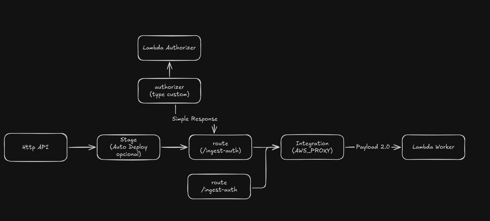

# Alexandria Pattern: AWS HTTP API (v2) + Lambda (Go)

Este projeto é um *Bluepa* (Blueprint) da biblioteca **Alexandria**, focado na implementação moderna, performática e custo-eficiente de APIs Serverless na AWS.

O objetivo é demonstrar o uso do **API Gateway v2 (HTTP API)** integrado a Lambdas em **Go (Golang)** rodando em arquitetura **Graviton (arm64)**, utilizando padrões avançados de autenticação e IaC.

## 🏛 Arquitetura

A solução utiliza o padrão **Lambda Authorizer** com o novo formato de payload v2.0 ("Simple Response"), eliminando a complexidade de políticas IAM e permitindo injeção de contexto diretamente para o Worker.



### Componentes Chave:
1.  **HTTP API (v2):** Menor latência e 70% menos custo que a REST API (v1).
2.  **Lambda Authorizer (Go):** Validação de token customizada com *Context Injection*.
3.  **Lambda Worker (Go):** Processamento de regras de negócio em `provided.al2023` (Graviton2).
4.  **Terraform Modular:** Infraestrutura como código para provisionamento e permissões.

---

## 🚀 Estrutura do Projeto

O projeto adota uma estrutura "Monorepo-like" para funções Go, onde cada Lambda possui seu próprio `go.mod`, mas compartilham a orquestração via Makefile.

```text
.
├── Makefile                # Orquestrador de Build, Deploy e Testes
├── images/                 # Diagramas e assets de documentação
├── src/
│   ├── authorizer/         # Função de Autenticação (Simple Response)
│   └── worker/             # Função de Negócio (Proxy Integration)
└── terraform/              # Infraestrutura (IaC)
    ├── main.tf
    ├── apigw.tf            # Definição da API e Stages
    ├── auth.tf             # Definição do Authorizer
    ├── worker.tf           # Definição das Rotas e Integrações
    └── ...

```

---

## 🛠 Pré-requisitos

* **Go** 1.20+
* **Terraform** 1.0+
* **AWS CLI** configurado
* **Make** (Build automation)
* **Zip** e **JQ** (Opcional, para visualização de logs)

---

## ⚡ Quick Start

O projeto utiliza um `Makefile` robusto para abstrair a complexidade de compilação cross-platform e deploy.

### 1. Inicializar

Baixa os providers do Terraform e prepara o ambiente.

```bash
make init

```

### 2. Build & Deploy

Compila os binários Go para Linux/ARM64, zipa os artefatos e aplica o Terraform.

```bash
make deploy

```

### 3. Testar (End-to-End)

O Makefile possui testes integrados que capturam a URL da AWS e disparam requisições `curl`.

**Teste Rota Pública (Sem Auth):**

```bash
make test
# Esperado: 200 OK

```

**Teste Rota Protegida (Com Auth):**

```bash
make test-auth
# Esperado: 200 OK com Contexto injetado ("user": "authorized-user")

```

Para destruir a infraestrutura:

```bash
make destroy

```

---

## 🧠 Conceitos Deep Dive

### Por que HTTP API (v2)?

Diferente da REST API (v1), a v2 foi desenhada para ser um proxy de baixa latência.

* **Custo:** ~$1.00/milhão de requisições (vs ~$3.50 na v1).
* **Performance:** Remove overheads de transformação de dados (VTL).
* **Simplicidade:** Auto-deploy nativo e CORS simplificado.

### Authorizer: Simple Response & Context Injection

Utilizamos o `payload_format_version = "2.0"` no Authorizer.

* **Simple Response:** Retorna apenas `{ "isAuthorized": true }` em vez de um documento JSON de Policy IAM complexo.
* **Context Injection:** O Authorizer valida o token e passa dados (ex: `user_id`, `role`) para o Worker via `event.RequestContext.Authorizer.Lambda`. Isso evita que o Worker precise bater no banco de dados ou revalidar o token novamente (DRY & Performance).

### Go + Graviton (arm64)

As funções são compiladas para processadores AWS Graviton2.

* **Custo:** 20% mais barato que x86.
* **Performance:** Melhor relação preço/performance para workloads Go.
* **Runtime:** `provided.al2023` oferece um ambiente Linux mínimo e extremamente rápido (Cold starts reduzidos).

---

## 📝 Notas de Desenvolvimento

* **Logs:** Os logs são enviados para o CloudWatch em formato JSON estruturado, facilitando queries no CloudWatch Logs Insights.
* **Segurança:** O exemplo usa um token Hardcoded (`alexandria-secret`). Em produção, substitua a lógica do `src/authorizer` por uma validação JWT (RSA/HMAC) real ou utilize o *JWT Authorizer* nativo da AWS se não precisar de lógica customizada.

---

*"Pragmatismo é a arte de simplificar o complexo."* - Alexandria
