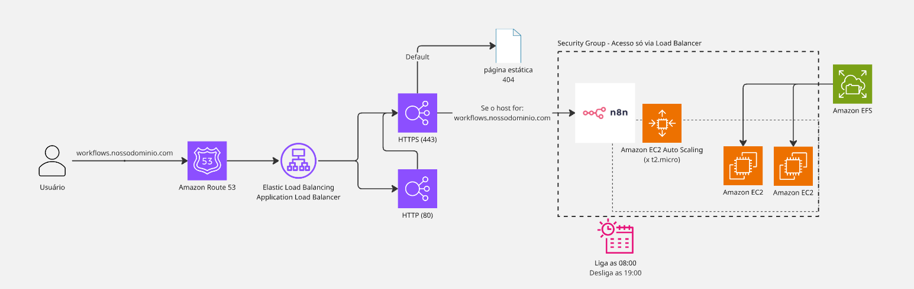

# N8N na AWS com terraform!

Vamos apresentar 2 formas de setup dependendo do que você já tiver, nos baseando nessa arquitetura aqui:

# Já tenho um load balancer, só preciso integrar nele

Precisamos só prover um target group para que você possa conectar um listener rule no seu load balancer, portanto vamos fazer só a parte computacional do setup:

- EFS: como um pendrive compartilhado espetado dentro do nosso EC2, mesmo se nossas instâncias cairem, os dados do n8n estão protegidos (por que não usar um DB no RDS? significaria +11$ no projeto o que não justifica muito se com Backups az no EFS temos uma resiliência muito similar) 
- EC2: Para rodar um docker com o N8N, configurar a pasta que vamos mapear nosso "pendrive" EFS e configurar o docker volume para apontar pra lá!
- Auto Scalling Group + Schedules: para desligar nosso projeto fora dos horários úteis que não estivermos trabalhando para economizar um pouco a mais!
- Target Group: para que todas nossas instâncias estejam mapeadas no mesmo lugar, e aí só apontar um listener do nosso load balancer para ele!

## O que preciso configurar para encaixar na minha infraestrutura?

- Configurar as subnets: aqui eu estou utilizando a padrão A em north virginia, caso sua infra já esteja nessa região já vai funcionar, se não, só mudar a região no provider para a sua ex: ohio (us-east-2) que ele pegará a padrão de lá, caso não esteja na vpc padrão, será necessário setup manual mesmo.

Buscaremos realizar a integração do N8N de forma segura pronta para plugar na sua cloud AWS em um load balancer já existente, portanto o que iremos construir e por que fizemos dessa forma?

O que é necessário ter anterior ao nosso terraform?
- Já ter criado dominio criado na AWS (route 53) (em menos de 5 mins você compra seu dominio lá ex: gatosedados.com)
- Um certificado ssl/tls no via AWS ACM certificate (é rapidinho, só colocar o seu dominio lá e tambem o *.seudominio.com)
